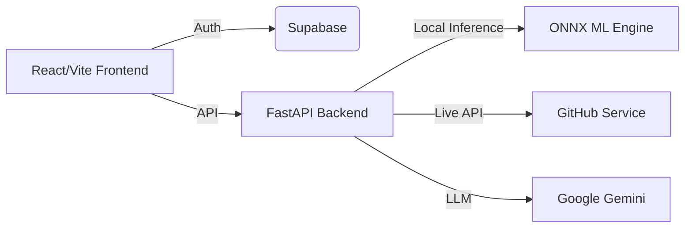

# SkillProof ATS | AI-Powered Resume Intelligence

SkillProof ATS is a next-generation Applicant Tracking System that replaces traditional keyword-based filtering with **Context-Aware Semantic Matching** and **Deep Achievement Quantification**.

[](https://skillproof-ats.vercel.app/)
[](https://opensource.org/licenses/MIT)

## 🧙‍♂️ Intelligent Career Companion
Instead of a "black box" that rejects resumes, SkillProof understands the engineering depth behind your experience.

- **🧠 ONNX-Powered Semantic Matching**: Uses a local, quantized MiniLM engine for context-aware scoring without external API dependencies.
- **💻 GitHub Deep Scan**: Quantifies technical impact by analyzing commit consistency, language diversity, and project contributions.
- **💬 Sage Chat**: A conversational AI career mentor that helps candidates bridge skills gaps and prepare for specific role types.
- **🛡️ The Vault**: Secure, persistent resume storage and historical analysis trail powered by Supabase.

---

## 🏗️ Technical Architecture

SkillProof utilizes a decoupling strategy to balance high-performance AI inference with a lightweight frontend experience.



### 🧠 Major Engineering Win: ONNX Migration
The original engine relied on heavy `torch` dependencies, requiring ~800MB of RAM. We refactored the entire intelligence layer to use **ONNX Runtime** and **MiniLM-L6-v2 quantization**, reducing the memory footprint to **~250MB** (a 70% reduction) and enabling cost-effective free-tier deployment on **Render**.

---

## 🛠️ Tech Stack

### Frontend
- **Framework**: React / Vite
- **Styling**: Vanilla CSS (Modern Glassmorphic Design System)
- **State/Auth**: Supabase Client SDK
- **Icons**: Lucide React

### Backend
- **API**: FastAPI (Python)
- **AI/ML**: ONNX Runtime, Tokenizers, NumPy, Gemini Pro API (Sage Chat)
- **GitHub Integration**: Custom Python profile analysis engine
- **Deployment**: Render (Docker/Slim-Python), Vercel (Frontend), Supabase (Database/Auth)

---

## 🚀 Getting Started

### Prerequisites
- Python 3.9+ 
- Node.js 18+
- Supabase Project URL & Keys

### Installation
1. **Clone the repo**
   ```bash
   git clone https://github.com/Vikhyat1026/SkillproofATS.git
   ```

2. **Backend Setup**
   ```bash
   cd backend
   pip install -r requirements.txt
   uvicorn main:app --reload
   ```

3. **Frontend Setup**
   ```bash
   cd frontend
   npm install
   npm run dev
   ```

---

## 🔐 Privacy & Security
We believe your career data belongs to you.
- Core resume scoring is performed **locally on our servers** using ONNX — your data is not sent to external LLMs for basic matching.
- Sensitive information in the Vault is encrypted using industry-standard protocols.

---

Built with ❤️ by [Vikhyat](https://github.com/Vikhyat1026)
